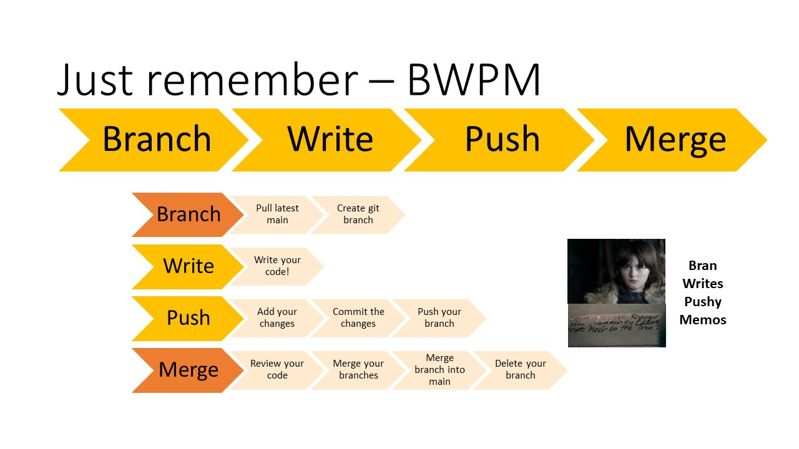
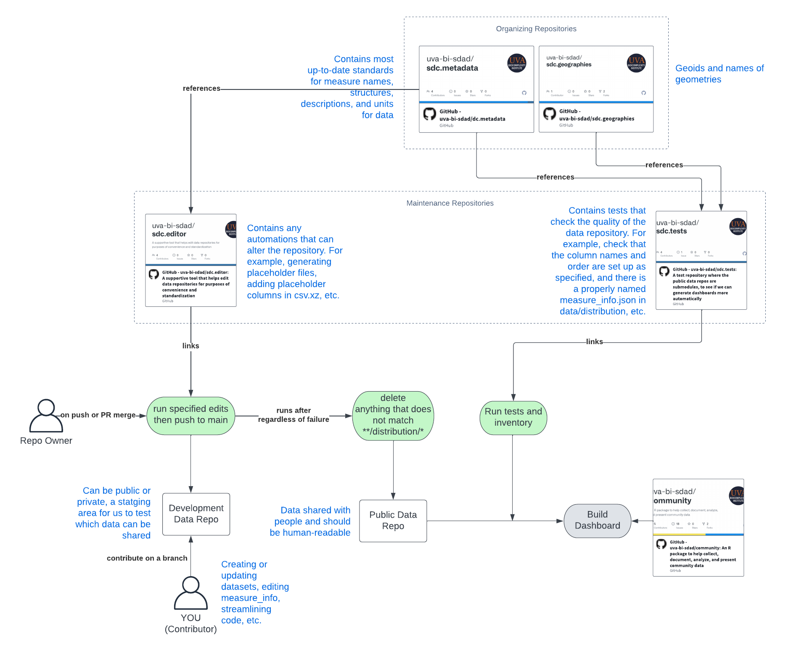

```{r setup, echo = FALSE, include = FALSE, eval = TRUE}
# Load packages
#knitr::opts_chunk$set(echo = FALSE, include = FALSE, eval = FALSE)
library(jsonlite)
library(DT)
library(purrr)
#library(tidyverse)
library(data.table)
library(foreach)
library(htmltools)
library(dplyr)

# Function to bind a list
rbindlist.v2 <- function(l)
{
  l <- l[lapply(l, class) == "list"]
  df <- foreach(element = l, .combine = bind_rows) %do%
    {df = unlist(element); df = as.data.frame(t(df)); rm(element); return(df)}
  rm(l)
  return(df)
}
```

## GitHub materials




  - [Intro to Git v.2023](https://github.com/uva-bi-sdad/dspg23_explore/blob/main/docs/00_github_1.pdf)
  - [Intro to Git v.2022](https://github.com/uva-bi-sdad/sdc.metadata/blob/main/web/media/Intro to Git 2022.pdf)
  - [GitHub Issues](https://github.com/uva-bi-sdad/sdc.metadata/blob/main/web/media/GitHub Issues.pdf)

## Developer workflow



## Standards
### Repo organization
  - We have 11 data repositories, divided thematically by general data topics
    - sdc.broadband
    - sdc.business_climate
    - sdc.demographics
    - sdc.education
    - sdc.environment
    - sdc.financial_well_being
    - sdc.food
    - sdc.health
    - sdc.housing
    - sdc.transportation
    - sdc.public_safety
  - Within a repository, data is organized in thematic topic folders
  - Within a most specific top folder, we have (as necessary)
    - code
      - all code used to replicate a distribution dataset
      - Use the following naming conventions
        - `ingest` files contain steps to acquire the data, write to /original
        - `prepare` files contain data manipulation, write to /working or /distribution
    - data
      - All original, intermediary, and final datasets in appropriate folders
      - See dataset <a href = '#table'> table naming guidelines</a>
    - docs
      - Supporting documentation for data or methods (e.g. literature or technical reports)
  - Within /code, /data, /docs, we have (as necessary)
     - original
     - working
     - distribution
        - /distribution datasets need to be compressed
        - /distribution datasets need to follow the <a href = '#cols'> column names</a>
        - /distribution datasets need a <a href = '#measure_info'> measure_info file</a>
  - **All /distribution datasets need /distribution code**


### Column names {#cols}
```{r column_descriptions, eval = TRUE, echo = FALSE, include = TRUE, message = FALSE, warning = FALSE}
url <- "https://raw.githubusercontent.com/uva-bi-sdad/sdc.all/main/data/measure_info_all.json"
json <- fromJSON(url)

list <- rbindlist.v2(json) %>% as.data.frame() %>% select(category, short_name, long_name, short_description, long_description, statement) %>% mutate(measure = names(json[lapply(json, class) == "list"])) %>% select(measure, category, long_name, long_description)

categories <- unique(list$category) %>% paste0(., collapse = ", ")

region_types <- unlist(read_json("https://raw.githubusercontent.com/uva-bi-sdad/sdc.metadata/master/data/region_types.json")) %>% paste0(., collapse = ", ")
measure_types <- unlist(read_json("https://raw.githubusercontent.com/uva-bi-sdad/sdc.metadata/master/data/measure_types.json")) %>% paste0(., collapse = ", ")

data.table(as.character(read_json("https://raw.githubusercontent.com/uva-bi-sdad/sdc.metadata/master/data/column_structure.json"))) %>% 
  cbind(c(
    "ID for the geography", 
    "Human and machine readable ID for the measure",
    "Margin of error for the measure",
    #paste0("Type of the measure, one of [", measure_types, "]"),
    #"Name of the region mapped to geoid, see <a href = 'https://github.com/uva-bi-sdad/sdc.geographies'>
    #sdc.geographies standards</a>",
    #paste0("Geographic resolution of the measure, one of [", region_types, "]"),
    "Value for the given measure, geoid, and year combination",
    "The year of the measure")) %>% 
   cbind(c(
     "See <a href = 'https://github.com/uva-bi-sdad/sdc.geographies'> sdc.geographies 
     </a> for IDs",
     "See <a href = '#measure'> measure guidance</a>",
     "NA if unavailable",
     "",
     "YYYY")) %>%
  datatable(colnames = c("Column name", "Description", "Allowed Values/Format"),
            options = list("pageLength" = 20),
            escape=FALSE, rownames = FALSE)
```

### Table naming guidance {#table}

The naming convention for data tables is as follows: 

`<coverage_area>_<resolution>_<data source>_<time period>_<title>`

For example, a table created from ACS 5 year data on health insurance could look as follows: 
`va_bg_acs5_2015_adults_health_insured_by_sex `


  - Abbreviation Standards 
    - Coverage Area (2 characters for state/province or country; 3 fips characters for sub-state/province) 
      - us, United States 
      - va, Virginia 
      - va013, Virginia, Arlington County  
    - Resolutions (2 characters) 
      - bl, census block 
      - bg, census block group 
      - tr, census tract 
      - nb, neighborhood 
      - ct, county 
      - hd, health district 
      - co, country 
      - pl, place locations 
      - pr, person data 
      - bz, business data 
    - Data Sources (up to 5 characters; this list will continually grow) 
      - acs5, American Community Survey 5-Year Data  
      - lodes, LEHD Origin-Destination Employment Statistics 
      - pseo, Post-Secondary Employment Outcomes 
      - qwi, Quarterly Workforce Indicators 
      - mcig, Mastercard Inclusive Growth Score 
      - hifld, Homeland Infrastructure Foundation-Level Data 
      - ookla, OOKLA for Good 
      - webmd, Web MD 
      - sdad, (items that we have calculated) 
      - abc,  census address block counts 

### Measure naming guidance {#measure}
  - Measures should be named to balance human and machine-readability. 
  - **Generally**, the format for measures should be `topic_method`.
  - Underscores should be used to separate words in a measure. 
  - Measures should be renamed to SDC style guidelines after we have manipulated them. 
  - The living list of abbreviations is UNDER CONSTRUCTION.  

## Writing measure_info

  - When writing measure_info, I would suggest starting with a copy of an exemplar measure_info or a closely related measure_info (e.g. describing data from the same source).
  - You can edit measure_info from RStudio, you're preferred code editor, or the GitHub GUI (really where ever you like)
  - It is important to avoid syntactical mistakes in your measure_info 
    - Use an editor that is smart for json syntax
    - Use a json linter library (e.g. `jsonlite::validate()`)
    - Use an [online json linter](https://jsonlint.com/)

### Keys {#measure_info}
```{r measure_info_key_descriptions, eval = TRUE, echo = FALSE, include = TRUE, message = FALSE, warning = FALSE}
data_types <-  unlist(read_json("https://raw.githubusercontent.com/uva-bi-sdad/sdc.metadata/master/data/data_types.json")) %>% paste0(., collapse = ", ")
units <-  unlist(read_json("https://raw.githubusercontent.com/uva-bi-sdad/sdc.metadata/master/data/units.json")) %>% paste0(., collapse = ", ")
aggregation_methods <-  unlist(read_json("https://raw.githubusercontent.com/uva-bi-sdad/sdc.metadata/master/data/aggregation_methods.json")) %>% paste0(., collapse = ", ")

data.table(as.character(read_json("https://raw.githubusercontent.com/uva-bi-sdad/sdc.metadata/master/data/measure_structure.json"))) %>%
  cbind(c(
    "",
    "Thematic category or categories for the measure", 
    "Citations for methods used to produce the measure",
    "Type of the data, automatically inferred",
    "Describes how the measure relates to equity",
    "Related shapefile of points to be displayed with the measure",
    "Long account of the production of the measure (no character limit). Should include detail on methods, multiple data sources, the way things were combined, decisions made to create the measure.",
    "Human readable long name for the measure (55 char limit)",
    "Type of the measure",
    "Short account of the production of the measure (100 char limit)",
    "Human readable short name for the measure (40 char limit)",
    "Data source from which the measure is derived",
    "Dynamic statement to describe the value of the data for a given geoid and year combination",
    "----",
    "Units associated with the measure, how to interpret",
    "",
    "")) %>% 
   cbind(c(
    paste0(aggregation_methods),
    paste0(categories), 
    "<a href = '#citations'> See citations format</a>",
    paste0(data_types),
    paste0('Status, Accessibility, Availability, or Affordability'),
    "<a href = '#layer'> See layer format</a>",
    "",
    "",
    paste0(measure_types),
    "",
    "",
    "<a href = '#sources'> See sources format</a>",
    "<a href = '#statement'> See statement format</a>",
    "----",
    paste0(units),
    "",
    "")) %>%
    cbind(c(
    "<a href = 'https://ddialliance.org/controlled-vocabularies'>DDI AggregationMethod</a>",
    "", 
    "<a href = 'https://www.bibtex.com/g/bibtex-format/'>BibTeX</a>",
    "<a href = 'https://www.w3.org/TR/xmlschema-2/'>W3C Datatype/DDI DataType</a>",
    "",
    "",
    "",
    "",
    "",
    "",
    "",
    "",
    "",
    "",
    "<a href = 'https://ddialliance.org/Specification/DDI-CV/AnalysisUnit_1.0.html'>DDI Analysis Unit</a>",
    "",
    "")) %>%
  datatable(colnames = c("Key", "Description", "Allowed Values/Format", "Derived From"), 
            options = list("pageLength" = 20),
            escape=FALSE, rownames = FALSE)
```

### Citations {#citations}
```{r eval = TRUE, echo = FALSE, include = TRUE, message = FALSE, warning = FALSE}
data.table(c("id",
             "author",
             "year",
             "title",
             "journal",
             "volume",
             "page",
             "doi",
             "version",
             "url")) %>%
            cbind(c(
              "The reference id, same as the citation entry name",
              "A list or list of lists specifying one or more authors. These can include entries for given and family names",
              "Year of the publication",
              "Title of the publication",
              "Journal in which the publication appears",
              "Volume number of the journal",
              "Page number of the journal",
              "Digital Object Identifier, from which a link is made (https://doi.org/{doi})",
              "Version number of software",
              "Link to the publication, alternative to a DOI"
            )) %>% 
  datatable(colnames = c("Key", "Description"), 
            options = list("pageLength" = 20),
            escape=FALSE, rownames = FALSE)
```

### Source {#sources}
```{r eval = TRUE, echo = FALSE, include = TRUE, message = FALSE, warning = FALSE}
data.table(as.character(read_json("https://raw.githubusercontent.com/uva-bi-sdad/sdc.metadata/master/data/source_structure.json"))) %>% 
  cbind(c(
    "Year of data access", 
    "Specific data product, if available",
    "Name of data provider/organization",
    "Location of a specific dataset description page or a general page for the data provider")) %>% 
  cbind(c(
    "YYYY",
    "",
    "",
    "")) %>%
  datatable(colnames = c("Key", "Description", "Allowed Values/Format"), 
            options = list("pageLength" = 20),
            escape=FALSE, rownames = FALSE)
```

### Statement {#statement}
```{r eval = TRUE, echo = FALSE, include = TRUE, message = FALSE, warning = FALSE}
data.table(c("region_name OR features.name", "value"),
  cbind(c(
    "Placeholder for the active region", 
    "Placeholder for the given value"))) %>% 
  datatable(colnames = c("Dynamic Reference", "Description"), 
            options = list("pageLength" = 20),
            escape=FALSE, rownames = FALSE)
```

### Layer {#layer}
```{r eval = TRUE, echo = FALSE, include = TRUE, message = FALSE, warning = FALSE}
data.table(c("source", "filter"),
  cbind(c(
    "Url to a geojson file (Note: Must point to a public repo (e.g. Not _dev))", 
    "optional"))) %>% 
  datatable(colnames = c("Key", "Description"), 
            options = list("pageLength" = 20),
            escape=FALSE, rownames = FALSE)
```


## How to set up environmental variables {#environ_vars}

In your home directory, create a file named ".Renviron". Write the names of your secrets and their value, like this to this file 
```{bash}
# Environmental variables can be in quotes or not in quotes #
CENSUS_API_KEY="secret"
db_usr="secret"
db_pwd="secret"
DATAVERSE_KEY="secret"
DATAVERSE_SERVER="secret"
OSRM_SERVER="secret"
BEA_API_KEY="secret"
my_secret="secret"
```

This file will execute in the terminal when your R session starts. To retrieve an environmental variable, execute this command in R
```{r}
Sys.getenv("my_secret")
```

In action, you might use environmental variables like this
```{r}
options(osrm.server = Sys.getenv("OSRM_SERVER"))
```

[You can also install your census API key through tidycensus](https://search.r-project.org/CRAN/refmans/tidycensus/html/census_api_key.html)
```{r}
library(tidycensus)

census_api_key("111111abc", install = TRUE, overwrite = TRUE)
# First time, reload your environment so you can use the key without restarting R.
readRenviron("~/.Renviron")
# You can check it with:
Sys.getenv("CENSUS_API_KEY")
```

Environmental variables are not only useful time savers, but they prevent us from commiting secrets to our public repositories! 
